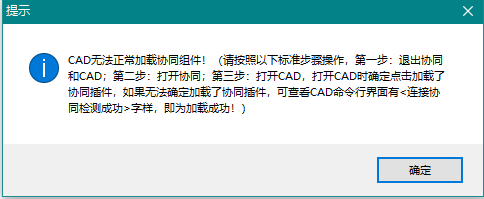

# 提资卡住  
    打开提资图，然后使用**pu**命令进行清理

# 调用CAD返回了错误的格式    

异常如图    
  
#### 解决方案
**CAD中开一个文件，空白文件也可以，需要保持CAD中有文件是打开状态**  

# CAD无法正常加载协同组件   

异常如图
  
#### 解决方案 
**重启CAD，在CAD打开时加载协同组件，如果没有提醒加载，查看CAD命令栏是否显示【协同设置为多文档模式.CAD_19.1s_(LMS_Tech)_c1c7674befe841b38f8353bcba636367 初始化连接成功】**  
如果该解决方案无法使用，请联系管理员索要*组件加载工具*

