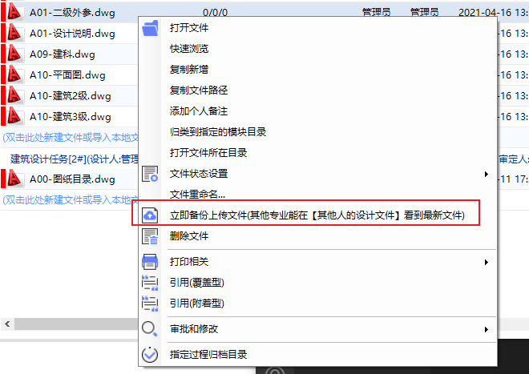
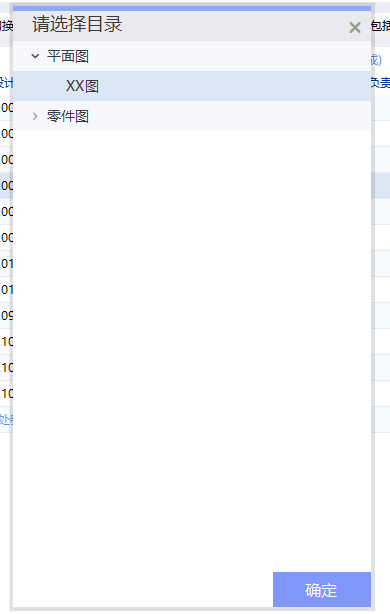

# 导出

导出文件有以下几种方式  
     

# 备份

协同提供三种备份方式
   1. 右键实时备份（**如果需要其他设计人实时看到最新文件**）  
        
   2. 备份已经修改的文件  
        
   3. 退出协同备份  
        

# 文件迁移

协同支持文件迁移到其他子项  

# 归类到模块目录    

协同可以配置**设计文件模块目录**    

    步骤：
        1. 选中要归类的文件
        2. 右键选中归类到制定模块
        3. 选择要归类的模块点击确定

    
    

# 文件协同作业  

协同支持多人画图作业，作业时需要设计人先把文件占用，其他设计人画图时需要占用人共享出来  
 1.  红色  文件自己占用   
 2.  黄色  文件被其他设计人占用   
 3.  绿色  文件没有被占用 

# 查看文件版本  

协同支持多版本查看，设计人可以选择**恢复版本**，亦可**浏览版本图**  

